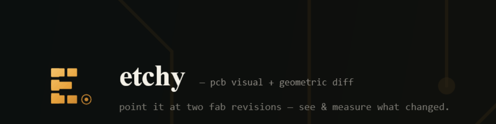

# etchy

> **Status: v0.1 — usable.** Diffs real Gerber + Excellon fab packs across the CLI,
> a native desktop viewer, and a web viewer, with prebuilt binaries and a
> distroless container. The Python predecessor is frozen at
> [Cimos/Gerber-Diff-Tool](https://github.com/Cimos/Gerber-Diff-Tool) (v0.11).

**etchy** is a fast, trustworthy, open-source **PCB visual + geometric diff** tool.
Point it at two revisions of a board's fab output and it shows — and measures —
exactly what changed.

## Quickstart

```sh
etchy old/ new/                       # terminal summary; exit 0 = no diff, 1 = diff, 2 = error
etchy old/ new/ --html diff.html      # a single self-contained HTML report
etchy old/ new/ --svg out/            # one SVG overlay per changed layer
etchy old/ new/ --format json         # machine-readable magnitudes (schema v1)
```

**Try it right now** — the repo ships two revisions of a real board (the open
[Mad_RP2040](https://github.com/Cimos/Mad_RP2040), Gerbers + Excellon drills):

```sh
etchy crates/etchy-gui/assets/demo/old crates/etchy-gui/assets/demo/new --html diff.html
# 10 of 13 layers changed — open diff.html to see every overlay
```

Diff two committed revisions straight from git, no checkout:

```sh
etchy v0.11 HEAD fab/                 # <refA> <refB> [subdir]
```

Gate CI on the **magnitude** and **location** of change:

```sh
# exit 1 only if copper changed by more than 0.5 mm²; silkscreen churn is ignored
etchy old/ new/ --gate-layers copper --fail-on-area 0.5
```

**Every PR that touches Gerbers gets a layer-by-layer diff comment** — five lines
add the Action to a repo (full recipe in
[`docs/ci-recipes/etchy-pr-diff.yml`](docs/ci-recipes/etchy-pr-diff.yml)):

```yaml
      - uses: Cimos/etchy@main
        with:
          old: fab/rev-a
          new: fab/rev-b
          comment: true
```

The job grants `pull-requests: write`; etchy supplies its own token and posts a
sticky per-layer table (added / removed mm² and region counts).

**PDF diff** — schematic PDFs get a page-by-page pixel diff (builds with
`--features pdf`; release binaries ship it on):

```sh
etchy old.pdf new.pdf --out overlays/   # per-page table + one overlay PNG per page
etchy old.pdf new.pdf --dpi 300         # crisper rasterization (default 150 DPI)
```

## Install

- **Prebuilt binaries** — download the archive for your OS from
  [Releases](../../releases) (Linux static-musl, macOS x86_64/arm64, Windows) and
  verify it against `SHA256SUMS`.
- **Container** (headless CLI, distroless, ~11 MB) — build it locally:

  ```sh
  docker build -t etchy .
  docker run --rm -v "$PWD:/work" etchy --format summary /work/old /work/new
  ```

- **From source** — `cargo install --path crates/etchy-cli` (needs a Rust toolchain).

The **desktop viewer** is a separate binary — `etchy-gui <old> <new>` — with a
changed-first layer list, overlay / before / after / split / swipe modes, pan /
zoom / fit, a settings panel, an Open-A / Open-B loader (folder, `.zip`, or
drag-and-drop), and a Help menu. A **web viewer** build also exists (see `deploy/`).

## What it does

- **Visual + geometric diff** of Gerber (RS-274X/X2), Excellon drill, and
  pick-and-place (centroid) revisions: a per-layer polygon boolean diff
  (`added = B − A`, `removed = A − B`) yields a resolution-independent **SVG
  overlay**, a self-contained **HTML report**, and **magnitudes** (changed area
  mm², region count) — all from one computation. Moved / rotated / added / removed
  **components** diff as placement markers.
- **CLI / CI-first:** exit codes, per-layer thresholds, git-refs, JSON (schema v1),
  a GitHub Action + Markdown PR summary; the egui viewer is the second surface.
- **Same-board revisions only** — fails loud on mismatched boards, never a garbage
  diff. **Trustworthy:** a golden corpus plus property and fuzz tests, and no
  silent misses — see [`docs/TRUST.md`](docs/TRUST.md).
- Ships as small **static binaries** and a **distroless container**.

**Non-goals:** net/connectivity diff, BOM/component diff, DRC, and Altium /
IPC-2581 / ODB++ ingestion. (Pick-and-place is diffed as *placement geometry* —
where parts sit — not a BOM/component list.) Native **KiCad `.kicad_pcb`**
ingestion is an accepted post-1.0 goal ([#122](../../issues/122)); KiCad
*schematic* diff stays out.

## Documentation

- [`docs/TRUST.md`](docs/TRUST.md) — the trust model + limitations: what etchy guarantees, and what it deliberately doesn't do.
- [`docs/ci-recipes/etchy-pr-diff.yml`](docs/ci-recipes/etchy-pr-diff.yml) — drop-in GitHub Action recipe for gating a PR on a board diff.
- [`docs/ROADMAP.md`](docs/ROADMAP.md) — phased plan to 1.0.
- [`docs/DEVELOPER_GUIDE.md`](docs/DEVELOPER_GUIDE.md) — architecture + the verified Rust crate stack.
- [`docs/PRODUCT_DISCOVERY.md`](docs/PRODUCT_DISCOVERY.md) — the requirements interview behind every decision.
- [`deploy/SETUP.md`](deploy/SETUP.md) — stand up the hosted web demo + feedback widget on a new machine.

> ⚠ **Before making this repo public**, work through [`PRE_PUBLIC.md`](PRE_PUBLIC.md) —
> notably, demo feedback under `deploy/feedback/` contains tester IP/UA/names that
> must be scrubbed first.

## Workspace

| Crate | Role |
|---|---|
| `etchy-core` | the engine: parse → resolve → polygonize → diff → measure → render |
| `etchy-cli` | binary `etchy` — the primary CLI/CI surface |
| `etchy-gui` | native egui viewer (separate binary; never compiled in headless builds) |
| `etchy-pdf` | schematic-PDF pixel diff (feature-gated; keeps the pure-Rust hayro PDF stack out of the core) |

## License

Dual-licensed under either of [MIT](LICENSE-MIT) or [Apache-2.0](LICENSE-APACHE)
at your option.
