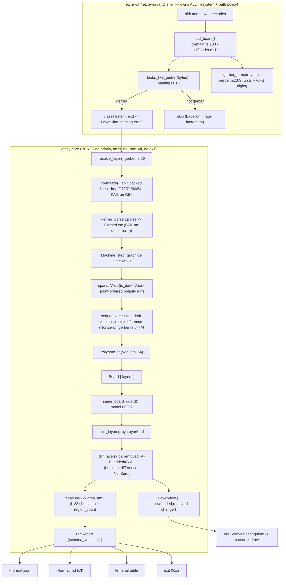
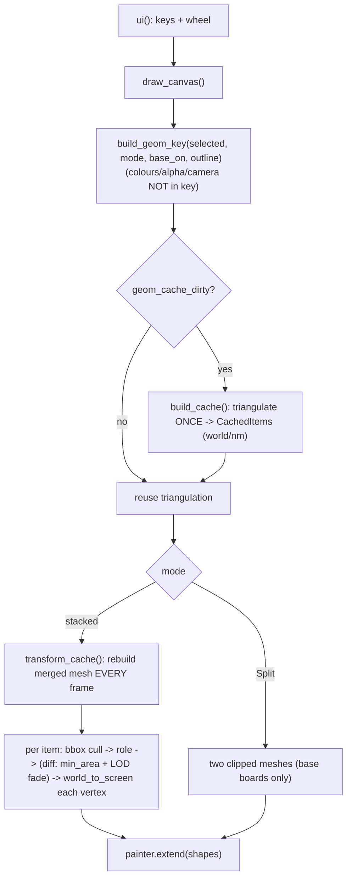

# etchy — full code review (2026-06-25)

A thorough, line-by-line review across **performance, security, portability/size, and
architecture/correctness**, run as a panel of four focused reviewers over the live
engine + GUI (the `etchy-core` / `etchy-cli` / `etchy-gui` / `etchy-pdf` crates) and the
`docs/`. Each reviewer read the real source (not the Phase-0 scaffold). Tests are green
(76 across the workspace: 39 core unit + 4 golden + 7 property + 2 CLI + 23 GUI + 1 pdf).

**Headline:** the core is unusually disciplined for its stage — small pure engine, the
i_overlay dependency quarantined to one file, fixed-point integers throughout, fail-loud
on every unsupported feature, and a real golden+property test harness. The work to do is
(1) **widen verification** (winding invariant, arcs, macros, fuzz) to match the geometry
the parser now accepts, (2) **bound resource use** (input-size + object-count caps), (3)
**cut the wasm bundle** (one wrong eframe default ships two GPU backends → 8.1 MB), and
(4) **scale large boards** (parallelism — partly done — + the quadratic span fix + the
per-frame render cost).

---

## 1. Pipeline (how a diff is produced)



The "one computation, three views" promise holds: a single `compare_detailed` produces
report + per-layer geometry. Two clean extension seams — the `Primitive` IR (Excellon
plugs in here) and the `PolygonSet` boolean boundary (`boolean.rs` is the only file that
names i_overlay types). Core purity is fully honored.

## 2. Winding & polarity (the correctness core)

```mermaid
flowchart TD
    START["flash / stroke / region / macro primitive"] --> KIND{builder?}
    KIND -->|circle/rect/obround/polygon/stadium| CCW["geom.rs builders emit CCW by construction"]
    KIND -->|G36/G37 region| EO["fill_even_odd()  boolean.rs:98 -> CCW-outer / CW-holes"]
    KIND -->|macro Outline (exporter chooses winding)| WIND["geo::wind(c, dark->CCW / clear->CW)  gerber.rs:559  (#48/#66 fix)"]
    CCW --> PUSH; EO --> PUSH; WIND --> PUSH["push(c, exposure)"]
    PUSH --> SEQ{resolve spans IN ORDER}
    SEQ -->|dark run| U["acc = union(acc, run)  NonZero"]
    SEQ -->|clear run| D["acc = difference(acc, run)  NonZero"]
    U --> SEQ; D --> SEQ
    SEQ -->|done| OUT["layer copper = sequential dark - clear"]
    subgraph RULE["invariant NonZero relies on (UNGUARDED - finding A1)"]
      R1["dark copper winds CCW (+area)"]
      R2["holes/clearances wind CW (-area)"]
      R3["overlapping same-polarity dark must ADD, not cancel to 0 (the #48 notch)"]
    end
```

The #48/#66 fix is now correct (wind only the macro `Outline`, leave region holes), but
the "every builder emits CCW" invariant is **load-bearing and asserted nowhere** — the
single highest-value test gap (finding A1).

## 3. GUI per-frame flow



The triangulation cache (G6) is correct and well-tested; the **per-frame transform +
mesh rebuild** runs unconditionally (finding P2). Split mode bypasses the noise filter +
LOD and draws only base boards (finding A5).

---

## 4. Findings by dimension (prioritized)

### Performance & scalability
- **P1 (HIGH) — Quadratic polarity-span accumulation** `gerber.rs:64-74`. Each polarity
  span re-feeds the whole accumulated geometry through i_overlay + `flatten`-clones it →
  O(spans·N) on negative-plane/thermal/anti-pad layers (the dense case). **#1 large-board
  bottleneck.** Fix: batch all-dark/all-clear into a constant number of overlay calls
  (`union(dark) − union(clear)`); drop the per-span flatten re-clone.
- **P2 (HIGH) — Full per-frame mesh rebuild** `etchy-gui/main.rs` `transform_cache`.
  Every repaint allocates a fresh `Mesh` (no `with_capacity` → repeated realloc) and
  re-transforms all visible triangles. Quick win: `reserve` capacity / reuse a persistent
  Mesh. Durable: the GPU-uniform-transform path (see §6).
- **P3 (HIGH/MED) — 3× geometry duplication** `lib.rs:76` + `diff.rs:78` + `boolean.rs:13`
  clone each `PolygonSet` three times; `LayerView` keeps old/new/added/removed resident.
  Fix: pass slices to `diff_layer`; `Arc` the `LayerView` geometry. **This also fixes the
  memory spike from the new parallel diff (below).**
- **P4 (DONE) — Per-layer parallelism.** ✅ Shipped in **PR #77**: rayon across layers,
  ~3.84s→3.06s (~20%) on the 26-layer production board, deterministic, wasm stays serial.
  Trade-off: peak RSS 122MB→404MB (concurrent scratch) — P3 is the follow-up that brings
  it back down. (i_overlay's `allow_multithreading` is OFF; left off deliberately to
  avoid nesting under rayon.)
- **P5 (MED) — Fixed 64-segment flash tessellation** `geom.rs:14`. Arcs adapt to a sagitta
  tolerance; flashes don't. 200k vias → ~12.8M vertices. Make `ngon`/`stadium` adaptive
  under the same tolerance (coordinate with the golden corpus, which assumes 64).
- LOW: `bbox_nm` double-walks points; `pair_layers` O(k²) (negligible at ≤30 layers).

### Security & robustness (threat model: untrusted Gerber/Excellon/PDF)
- **S1 (HIGH) — No input-size cap.** Loaders read whole files into RAM then copy ~3×
  (`from_utf8_lossy` + normalized copy). `cli/main.rs:114`, `gui/loader.rs:25`,
  `gerber.rs:166`. Fix: reject oversize files via `metadata().len()` before read.
- **S2 (HIGH) — No object/operation-count cap.** A tiny file with many large arcs (4096
  pts each) or many polarity toggles (O(N) boolean passes) → huge CPU/RAM. Amplification
  DoS, nasty for CI runners. Fix: ceiling on emitted contours/points/spans per layer,
  fail loud.
- **S3 (MED) — cargo-deny not enforced in CI; advisories not gated.** `deny.toml`
  `[advisories]` only denies `yanked`; no CI step runs it. Fix: add a `cargo deny check`
  job; gate vulnerability/unmaintained.
- **S4 (MED/HIGH) — `gerber_parser` (third-party) touches attacker bytes first; no
  cargo-fuzz target** despite the docs promising fuzz. Fix: `fuzz/` target over
  `resolve_layer`; wrap the parser in `catch_unwind` so an upstream panic stays a loud
  typed error.
- LOW: a few viewer `.expect()`s (demo path / internal invariants).
- **Strong points:** **no `unsafe` anywhere**; arithmetic well-guarded (`quantize_mm`/
  `snap_nm`, ±1e14 nm cap, i128 areas); path handling sound; errors fail loud.

### Portability, size & dependencies
- **Z1 (HIGH) — eframe pulls BOTH wgpu and glow** (default features) → two GPU backends +
  naga shader compiler → the 8.1 MB wasm bundle. Fix: `eframe = { default-features =
  false, features = ["glow", "default_fonts", "x11", "wayland"] }`. **Bonus: on the glow
  backend `cc.gl` exists, so the GPU transform path becomes feasible *and verifiable
  headless* (WebGL2) — see §6.**
- **Z2 (HIGH) — No release profile.** No `[profile.release]` anywhere. Add `opt-level="z"`,
  `lto="fat"`, `codegen-units=1`, `strip=true`, `panic="abort"` (GUI/CLI).
- **Z3 (HIGH) — `data-wasm-opt="2"`** (speed) on an already-bloated bundle; switch to `"z"`.
- **Z4 (MED) — deny.toml allow-list is incomplete** (would fail the real tree even though
  all licenses are permissive: `BSL-1.0`, `CC0-1.0`, `OFL-1.1`, `Ubuntu-font-1.0` missing).
  No genuine copyleft; two dual-licensed crates include a GPL/LGPL *option* (permissive arm
  selected — fine). Fix allow-list + wire into CI (with S3).
- **Z5 (MED) — wasm32 is never built/tested in CI** (the whole web viewer). Add a wasm job.
- **Z6 (MED) — `i_triangle` pinned in-crate, not in `[workspace.dependencies]`**; move it.
  Likely-unused `gerber-types` workspace dep (parser re-exports its own) — verify + drop.
- **Verdict:** core/CLI portability + purity are in good shape (CLI tree has **zero**
  egui/wgpu crates — separation holds). musl/distroless is clear today (pdfium is a stub);
  when pdfium lands it must use the `static` feature behind a non-default flag.

### Architecture & correctness
- **A1 (HIGH) — No winding-invariant test** for the geom builders (the assumption the whole
  NonZero scheme rests on). Add a property test: every builder returns positive shoelace
  area. Highest-value test gap.
- **A2 (HIGH) — No real fuzz target** (overlaps S4).
- **A3 (HIGH) — Aperture-macro primitives** (CenterLine/VectorLine/Polygon/rotation/offset,
  `gerber.rs:531-592`) have no geometry test; macros are common on real fab packs.
- **A4 (MED) — Arc tessellation** (`arc_points`/`arc_center`) untested for direction,
  multi-quadrant sweep, I/J center; no arc golden board.
- **A5 (MED) — Split view bypasses noise filter + LOD** and draws only base boards →
  diverges from Overlay for the same diff. Document or route through the same cull.
- **A6 (MED) — `same_board_guard` tolerance is 10%/2 mm in code but 2%/1 mm in the spec**
  (`model.rs:214` vs `M1_ENGINE_DESIGN.md:86`). Looser-than-documented guard slightly
  raises the odds of diffing two different boards as same-board. Reconcile + comment.
- **A7 (MED) — `load_board` triplicated** (cli + gui + wasm). Extract a shared helper.
- LOW: phantom `--force` referenced in error text but not implemented; 1175 lines of dead
  `examples/spike{1,2}.rs`; `etchy-gui/main.rs` is 2021 lines (split into modules).

---

## 5. Top priorities (consolidated)

1. **Bound resources (S1 + S2)** — input-size + object-count caps. Biggest real-world
   risk against the threat model; cheap.
2. **Cut the wasm bundle (Z1 + Z2 + Z3)** — drop the wgpu backend (→ glow), add a size
   release profile, `wasm-opt=z`. Likely several MB off 8.1 MB. Z1 also unblocks the GPU
   perf path.
3. **Widen verification (A1 + S4 + A3 + A4)** — winding-invariant property test, a real
   cargo-fuzz target, macro + arc geometry tests. Matches the trust bar to the geometry
   actually accepted.
4. **Wire the guardrails into CI (S3/Z4 + Z5)** — cargo-deny + a wasm build job.
5. **Scale large boards (P1 + P3 + P2)** — quadratic span fix, cut the 3× clones (also
   fixes the parallel-diff memory spike), reduce per-frame render cost.

## 6. Strategic note — the renderer choice ties size and perf together

The GPU base-transform spike (for smooth many-layer pan) hit a wall: eframe defaults to
the **wgpu** renderer, whose custom pipeline blanked on this box's GL backend and can't be
verified headless. The portability review independently recommends **switching to the glow
backend** (for the 8.1 MB size win, Z1). These converge: on glow, `cc.gl` exists, the
glow `PaintCallback` runs on WebGL2/SwiftShader, so the GPU transform would be **smaller
*and* verifiable here**. Recommendation: do Z1 (glow) first, then revisit the GPU
transform via the glow path (the original spike approach, now justified). The 1a
default-one-layer win (~9×, merged) already covers the common case meanwhile.
